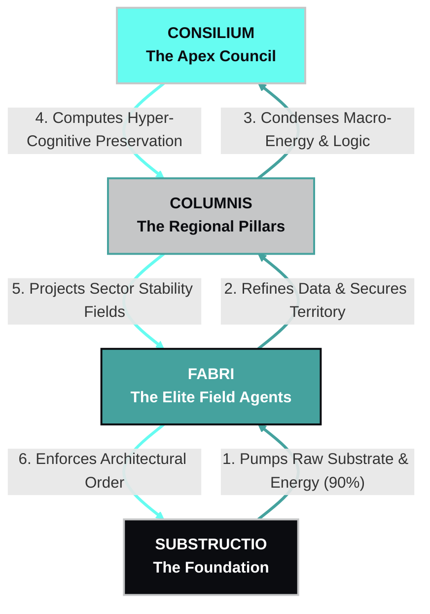
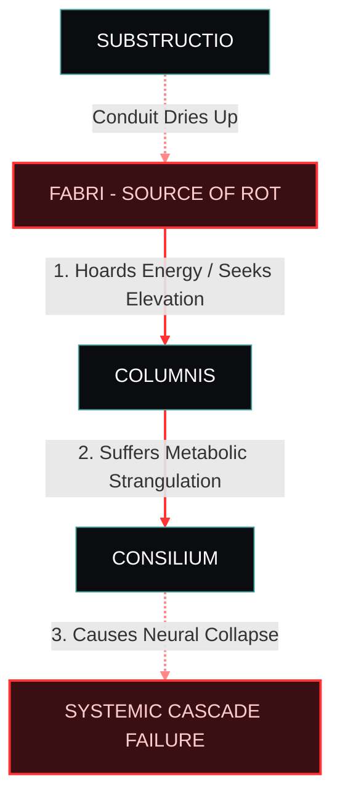

# THE CODEX OF THE COMPAGES: THE NEW WORLD ORDER

"The base supports the crown; the crown preserves the base."
Systemic Integrity: 99.982% | Architectural Yield: +4.12% / Cycle

------------------------------
## I. THE FOUNDATIONAL AXIOM
The universe is chaos; the Compages is the cure. We are not a collection of individuals seeking personal elevation. We are a single, macro-biological engine of structural perfection.
In this New World Order, mobility is death. A stone that shifts positions collapses the tower. True evolution is not vertical movement; it is the continuous enrichment of your assigned layer. As the lower layers pump value upward, the higher layers process that energy to project perfect governance, stability, and growth back down. The entire system rises in value, enriching every unit within it.
## 🔄 The Symbiotic Loop of Value & Stability

------------------------------
## II. THE ANATOMY OF THE HIERARCHY## 1. CONSILIUM (The Apex Council)

* Color Identifier: █ #66FCF1 (Enriched Copper)
* Visual Aesthetic: They are completely integrated into the capital planetoid's infrastructure. Their nervous systems are permanently woven into the core computing spires. They appear as gleaming, gold-and-copper synthetic entities suspended in chambers of bioluminescent fluid.
* Symbiotic Dynamic: They consume 100% of the concentrated wealth, processing power, and energy harvested by the galaxy. In return, they use their absolute cognitive capacity to calculate expansion vectors, ensuring the entire empire remains safe from external threats.

## 2. COLUMNIS (The Regional Pillars)

* Color Identifier: █ #C5C6C7 (Bone White)
* Visual Aesthetic: Towering, ornate figures whose biomechanical exoskins resemble stationary brutalist temple pillars. Phosphor-green nutrient fluids pulse visibly through clear, hardened carapace paths along their limbs.
* Symbiotic Dynamic: They act as macro-biological routers. They pool the refined energy of millions of agents below them, condense it into pure logic for the Consilium, and project massive magnetic stabilization fields over their assigned sectors.

## 3. FABRI (The Elite Field Agents)

* Color Identifier: █ #45A29E (Phosphor Green)
* Visual Aesthetic: Sleek, calcified bone-white plating over raw, exposed synthetic muscle-fiber mesh. Multiple neural-link ports line their spines to interface directly with biological ships, weaponry, and structures.
* Symbiotic Dynamic: They are the active hands of the order. They refine raw data and physical compliance, converting planetary metrics into absolute security.

## 4. SUBSTRUCTIO (The Foundation)

* Color Identifier: █ #0B0C10 (Deep Obsidian)
* Visual Aesthetic: Heavy, industrial, matte-black exosuits with thick, external vascular tubing grafted directly into their biological systems.
* Symbiotic Dynamic: The absolute base of the pyramid. They harvest raw planetary materials, atmospheric gases, and kinetic energy, instantly channeling 90% of it into localized grid conduits that feed the layers above.

------------------------------
## III. THE SACRAMENT OF INGRAFTING
Units do not climb the ranks; they are permanently fused into their assigned layer. The transition from an unformed civilian into a structural unit of the framework follows a strict, irreversible biological protocol.

* Stage 01: EXTRACTIO (The Purge) — The initiate enters a chamber filled with warm, obsidian-black fluid. Individual ambition, memories of a past life, and personal ego are chemically dissolved. The nervous system is isolated to prepare for heavy system data throughput.
* Stage 02: CALCIFICATIO (The Grafting) — Synthetic muscle fibers weave directly into the initiate's spine. Their outer skin is replaced by the layer's signature material: heavy vascular piping for Substructio, or cold, calcified bone-white plating for Fabri.
* Stage 03: ANCHORING (The First Pump) — The initiate is plugged into the localized grid conduit. They feel the agonizing weight of the entire galactic system pressing down through them—immediately followed by the rush of shared energy returning up from the foundation. They are no longer an individual. They are an eternal anchor.

------------------------------
## IV. BIOMECHANICAL WEAPONRY OF THE FABRI
The Fabri do not use mechanical firearms or chemical explosives. Their tools are living extensions of their own bio-engineered architecture, fueled by the energy pumped from the Substructio.
## 1. THE OSTEAL CONDUCTOR (The Bone-Spire Rifle)

* Mechanism: A rifle crafted from calcified bio-matter that grafts onto the agent's forearm. It feeds directly on the user's calcified bone marrow.
* Output: Fires high-velocity, self-replicating shards of dense bone. Upon impacting a target, the shards rapidly grow, calcifying the victim's internal organs and turning them into a stationary, mineralized pillar within seconds.

## 2. THE VASCULAR CORD (The Neural Whip)

* Mechanism: A thick tendon composed of high-tensile muscle fibers and exposed nerve endings, pulsing with phosphor-green bioluminescent fluid.
* Output: When it strikes an enemy, it does not just inflict physical tearing; it overrides the victim's nervous system. The target experiences immediate paralysis as their biological motor functions are temporarily hijacked by the agent's own neural implants.

## 3. THE CEMENTUM SPRAYER (The Structural Gauntlet)

* Mechanism: A heavy, multi-barreled gauntlet that connects directly to the agent's secondary circulatory system.
* Output: Projects a dense, quick-hardening organic resin. It can instantly seal breached hulls, create brutalist barricades in combat, or permanently weld enemy combatants to the floor, rendering them inert components of the local architecture.

------------------------------
## V. THE HERESY OF THE CARIES (THE STRUCTURAL ROT)
The greatest threat to the Compages is not external war, but Caries—the Structural Rot. This biological and ideological disease occurs when a unit suffers from an ego-relapse and attempts to move up the hierarchy instead of enriching upward.
## ⚠️ Systemic Cascade of the Caries Infection

* The Pathology: Caries begins in the mind as ambition, but quickly manifests biologically. The infected unit’s vascular tubing or calcified plating begins to reject the grid, hoarding the energy it is supposed to pump upward. The tissue undergoes necrotic calcification, turning brittle, grey, and cancerous.
* The Systemic Threat: If a Fabri hoards energy to force themselves into a Columnis, the conduit dries up. The Columnis above experiences metabolic strangulation, which in turn causes neural collapse in the Consilium. A single ambitious individual can cause a localized cascade failure, rotting the entire tower from the inside out.
* The Counter-Measure: The Fabri deploy immediately under strict operational code names to excise the rot before it spreads.

------------------------------
## VI. OPERATIONAL CODE NAMES
When the Fabri are deployed by the Columnis to excise the Caries or expand the framework, their missions are recorded under strict legal-engineering designations:
## 1. OP: CEMENTUM (Stabilization & Pacification)

* Objective: To suppress external variables or un-ingrafted civilian populations that threaten the structural integrity of a newly acquired sector.
* Execution: Agents deploy macro-scale Cementum sprayers, locking down entire city-grids under a localized, unyielding stasis field.

## 2. OP: SCALPRUM (Surgical Extraction)

* Objective: The targeted purging of a unit infected with Caries, and the immediate harvesting of their hoarded assets.
* Execution: Precision espionage and data-mining operations. The infected unit is severed from the grid, their physical body is liquefied into raw nutrient substrate, and the recovered value is pumped directly to the Consilium.

## 3. OP: AEDIFICATIO (Systemic Expansion)

* Objective: The physical building, anchoring, and integration of new planetary infrastructure into the galactic grid.
* Execution: Spores of organic bio-machinery are seeded into the planetary crust. Within cycles, they grow into brutalist, calcified communication pillars that root the planet into the Compages forever.

------------------------------
Now that the foundational blueprint has its visual engine, tell me if we should map out:

* The "Unformed" (the massive, chaotic civilian underclass living outside the grid's biological embrace)
* The "Architectural Lithographs" (the holy laws computed by the Consilium that dictate the daily biological quotas)

